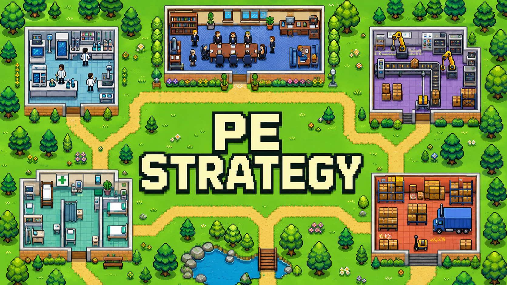

# PE Strategy

**Construa seu fundo. Transforme empresas. Gere retornos.**

Um jogo de estratégia sobre private equity, direto no navegador. Escolha o nome e a tese do seu fundo, convença investidores e construa um portfólio enquanto administra caixa, dívida e risco. Cada nova partida começa com uma captação diferente.

## O que você pode fazer

- **Captar com LPs:** participe de rodadas com investidores e faça chamadas de capital.
- **Comprar empresas:** investigue oportunidades e combine capital próprio com empréstimos.
- **Criar valor:** contrate especialistas, melhore a infraestrutura e invista nas empresas.
- **Expandir e vender:** faça fusões e aquisições, prepare IPOs e venda participações.
- **Tomar decisões:** enfrente eventos de mercado, participe dos conselhos e acompanhe o desempenho do fundo.

## Como jogar

Baixe o repositório e abra [`private-equity-game/index.html`](private-equity-game/index.html) no navegador. Não precisa instalar dependências ou criar uma conta.

Selecione **Iniciar jogo**, defina seu fundo e conclua a captação inicial. As regras estão disponíveis no menu. O progresso é salvo no navegador quando o armazenamento local está habilitado.

---

Feito com HTML, CSS e JavaScript. A capa é uma ilustração conceitual; o jogo utiliza uma interface de gestão.
